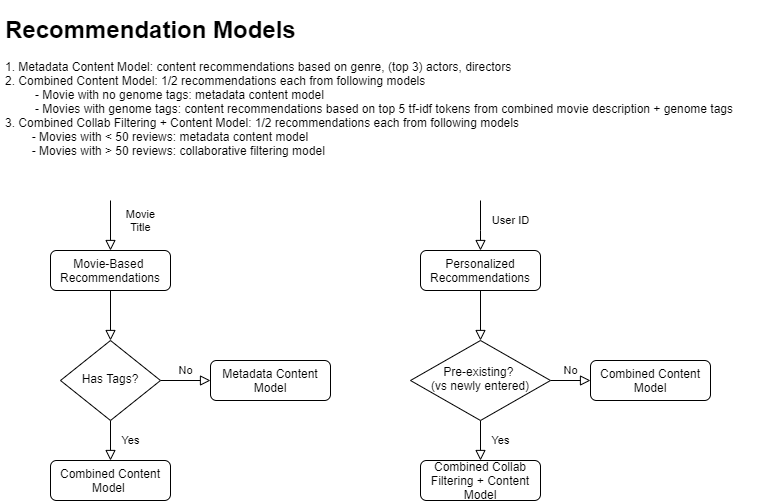

# DS5500-Movie-Recommendation-System
Movie-Recommendation-System

### Personalization: maximize differences between move recommendations for different people
Want recommendations that are actually personalized to the person    
K fold cross-validation across several sets of users

### Precision, Recall @ K
- Generate recommendations based on training data. See if get movies from the test data that the user actually liked    
- Evaluating on train/test split because do not have real time user feedback, which is ideal.      
- Very hard to get good scores because if rated 100 movies but there are 10,000 movies in the catelog, unlikely that you will recommended one of those 100 movies in the top K. Doesn't mean bad recommendations. 

### Personal Diversity 
Content models tend to create overspecialization where users are only presented with one type of movie. Thus need to evaluate the degree of this problem. Ideally would provide some variety.   
Filtering function in UI also helps deal with this problem as users can view specific types of recommendations   
- Find cosine similarity between recommended movies for a particular user
- Movie features depend on the model being evaluated (if tags model, look at diversity of tags. If genre, actors model, look at diversity of genres and actors)

## Average Rating
Want to recommend "good" movies with high average ratings. Recommendation system is not specifically designed for this, but good to track across systems   
- Generate recommendations for random users
- Merge in average ratings of the recommended movies
- Take average of average ratings 
- Take average across random sample of users

## Global Diversity
Want to recommend some "unpopular" movies such that users view movies in the long tail that they otherwise would not be exposed to
- Generate recommendations for random  users
- Merge in count of number of reviews for the recommended movies
- Take the minimum count (extent of the long tail)
- Average minimum counts across random users
